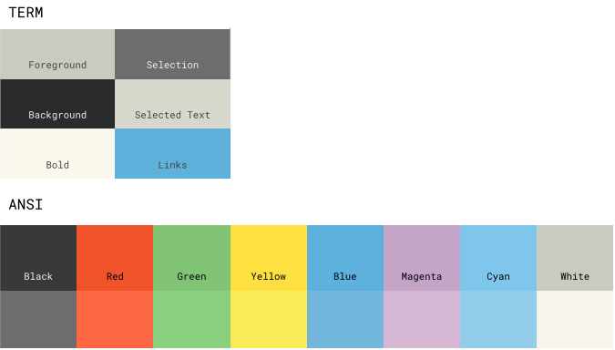

:warning: **Prompt code moved [here](https://github.com/loliee/prompt-patatetoy) !**

# Patatetoy

Patatetoy is a joyful color scheme for daily use.

## Why ?

The goal is to provide a set of **punchy colors** with **non-agressive** tones 🎨

>〝I wrote this color scheme a few years ago to fit my needs and I am still happy to use it everyday.”

## Colors

## Install

See specific application `README` for install details.

- [vim](https://github.com/loliee/vim-patatetoy)
- [iTerm2](https://github.com/loliee/iterm2-patatetoy)
- [Terminal.app](https://github.com/loliee/patatetoy/master/macos-terminal)
- [Terminator](https://github.com/loliee/patatetoy/master/terminator)

## The Values

| TERMCOL   | HEX        | RGB         | HSB         |
| ----------| -----------|:-----------:| ------------|
| black     | `#6c6d6c`  | 108 109 108 | 106 04  109 |
| blackbr   | `#292b2d`  | 41  43  45  | 152 24  45  |
| blue      | `#5eb1dd`  | 94  177 221 | 142 145 221 |
| bluebr    | `#73b8dc`  | 115 184 220 | 141 121 220 |
| cyan      | `#7ec6eb`  | 126 198 235 | 142 117 235 |
| cyanbr    | `#91cce9`  | 145 204 233 | 141 96  233 |
| green     | `#82c476`  | 130 196 118 | 78  100 196 |
| greenbr   | `#88d07e`  | 135 208 126 | 79  101 208 |
| magenta   | `#c4a5c7`  | 196 165 199 | 209 42  199 |
| magentabr | `#d5b7d4`  | 213 183 212 | 213 35  213 |
| red       | `#f0522a`  | 240 82  42  | 8   209 240 |
| redbr     | `#fe6743`  | 254 103 67  | 8   187 254 |
| white     | `#c9cac0`  | 201 202 192 | 44  12  202 |
| whitebr   | `#f7f5eb`  | 247 245 235 | 35  12  247 |
| yellow    | `#fee040`  | 254 224 64  | 35  190 254 |
| yellowbr  | `#fae959`  | 250 233 89  | 38  164 250 |

## Screenshots

### iTerm2

### Vim

## License

MIT © Maxime Loliée

## Author

- [Maxime Loliée](http://github/loliee)
