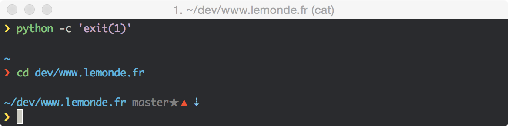

# Patatetoy

[](https://travis-ci.org/loliee/patatetoy)

> Pretty, minimal and fast `Zsh/Bash` prompt, initialy forked from [pure](https://github.com/sindresorhus/pure).



## Why?

- Add bash version.
- Add python virtualenv support.
- Add git rebase/merge steps.
- Add vi mode support (zsh version only).
- Add configuration vars for colors and symbols, see [#options] section.

## Install

Clone repository.

```bash
git clone https://github.com/loliee/patatetoy.git "$HOME/.patatetoy"
```

### Zsh

```
# .zshrc
fpath=( "$HOME/.patatetoy" $fpath )

autoload -U promptinit && promptinit
prompt patatetoy
```

### Bash

```
# .bashrc
source "$HOME/.patatetoy/patatetoy.sh
```

## Options

Possible colors are: `black` `red` `green` `yellow` `blue` `magenta` `cyan` `grey` `white`

Color configuration depend of which version you configure, zsh version don't require `$` prefix for setting color.

```bash
PATATETOY_GIT_ARROW_COLOR="blue" # Zsh
PATATETOY_GIT_ARROW_COLOR="$blue" # Bash
```

#### `PATATETOY_PROMPT_SYMBOL`

Character to use as prompt symbol, default `❯`.

#### `PATATETOY_CURSOR_COLOR_OK`

Define cursor color for sucessed previous command.

#### `PATATETOY_CURSOR_COLOR_KO`

Define cursor color for failed previous command.

#### `PATATETOY_VIM_MODE` **(zsh version only)**

Unset by default, set to `1` to enable vi-mode visual indicator

#### `PATATETOY_GIT_DIRTY_SYMBOL`

If git repository is dirty, default to `✗`.

#### `PATATETOY_GIT_ARROW_COLOR`

Define git upstream arrow's color.

#### `PATATETOY_GIT_UP_ARROW`

Git upstream forward char, default to `⬆`.

#### `PATATETOY_GIT_DOWN_ARROW`

Git upqtream behind char, default to `⬇`.

#### `PATATETOY_GIT_STASH_CHECK`

Set to `0` to disable stash checking.

#### `PATATETOY_GIT_STASH_SYMBOL`

Git stash char, default to `ⵢ`.

#### `PATATETOY_GIT_STASH_COLOR`

Define git stash char's color.

#### `PATATETOY_FORCE_DISPLAY_USERNAME`

Set to `1` to force username and host.

#### `PATATETOY_USERNAME_COLOR`

Define username/host color.

#### `PATATATETOY_ROOT_SYMBOL`

Define ROOT user warning symbol and color. default to `✦`.

#### `PATATETOY_ROOT_SYMBOL_COLOR`

Define root symbol color. default to `red`.

#### `PATATETOY_GIT_DIRTY_CHECK`

Set to `0` to disable dirty check. Only useful with `bash prompt version` and on extremely huge repos like the WebKit repo.

#### `PATATETOY_GIT_UNTRACKED_DIRTY`

Set to `0` to not include untracked files in dirtiness check. Only really useful on extremely huge repos like the WebKit repo.

#### `PATATETOY_GIT_PULL` **(zsh version only)**

Set `0` to prevent Patatetoy from checking whether the current Git remote has been updated.

#### `PATATETOY_GIT_DELAY_DIRTY_CHECK` **(zsh version only)**

Time in seconds to delay git dirty checking for large repositories (git status takes > 2 seconds). The check is performed asynchronously, this is to save CPU. Defaults to `1800` seconds.

#### `PATATETOY_CMD_MAX_EXEC_TIME` **(zsh version only)**

The max execution time of a process before its run time is shown when it exits. Defaults to `5` seconds.

## Example

```sh
# .zshrc

autoload -U promptinit && promptinit

# optionally define some options
PATATATETOY_CMD_MAX_EXEC_TIME=10
PATATATETOY_FORCE_DISPLAY_USERNAME=1
PATATATETOY_USERNAME_COLOR=red
PATATATETOY_VIM_MODE=1

prompt patatetoy
```

## Tips

- [patatetoy-iterm2](https://github.com/loliee/patatetoy-iterm2) colorscheme, for having the real patatetoy.
- [zsh-syntax-highlighting](https://github.com/zsh-users/zsh-syntax-highlighting), to colorized output.
- [sshrc](https://github.com/Russell91/sshrc), to bring the light bash version with you when you ssh.

## License

MIT © Maxime Loliée

## Author

- [Maxime Loliée](http://github/loliee)
- [Sindre Sorhus](http://sindresorhus.com)
